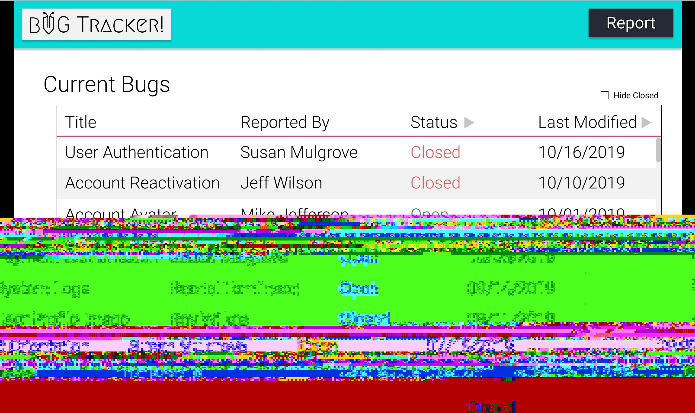
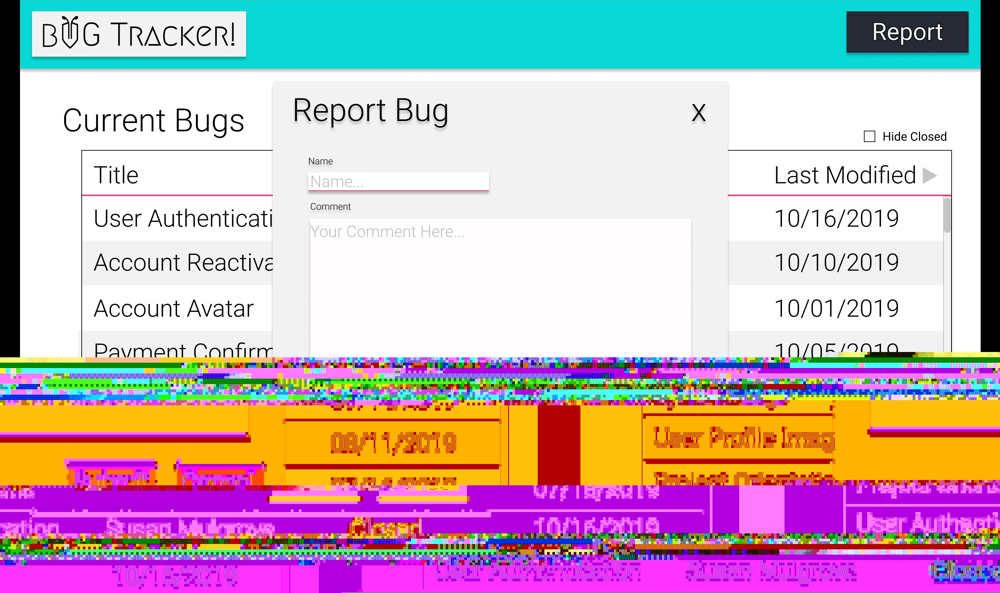
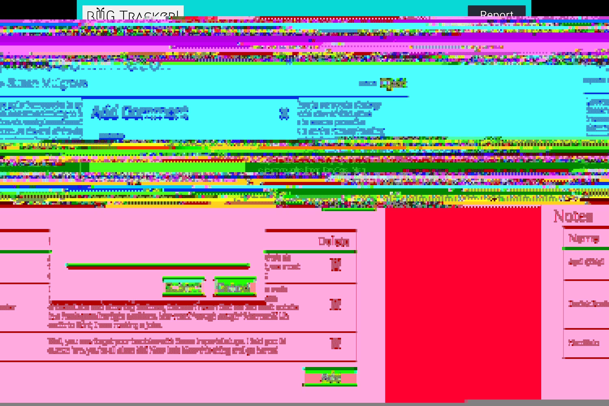

# Bug-Report

Welcome to the Bug-Report!

You have been tasked with creating a tool to better report bugs for your team. The goal being, to better track bugs in your application, as well as the process taken to solve them.

All bugs will have a title, description, who reported the bug, closedDate and whether or not it has been closed.

Users can also add notes to the bug report providing detailed steps towards the bugs resolution.

Once a bug has been closed, no further editing is allowed.

Here are some mock-ups from the client.

<hr>

### Home View:

<div>
  
</div>
<div>
  
</div>

From the Home page users can view all the bugs that have been added, color coded to which are open and closed(by status). You should be able to filter the bugs based on their status(open or closed).

#### Challenges

Try to implement pagination here(display limited number of bugs per page). Modals for creating bugs instead of a static form could be a nice feature as well.
<br>
<br>

<hr>

### Details View:

<div>
  
</div>
<div>
  
</div>

The details view provides some additional information about the bug, as well as showing all the notes made by other users. Here notes can be created or removed.

#### Challenges:

See if you can implement the ability to go next or previous from this page. Modals for creating notes would be a nice feature instead of a static form always visible on the page.

<hr>
<br>
<br>

## Bug-Report API

### Bug Schema

```Javascript
var bug = new Schema({
    closed: { type: Boolean, required: true, default: false },
    description: { type: String, required: true },
    title: { type: String, required: true },
    closedDate: { type: Date}
    creatorEmail: { type: String, required: true }
}, { timestamps: true, toJSON: { virtuals: true } })
```

### Note Schema

```Javascript
var note = new Schema({
    content: { type: String, required: true },
    bug: { type: ObjectId, ref: 'Bug' required: true },
    flagged: { type: String, enum: ["pending", "completed", "rejected"] }
    creatorEmail: { type: String, required: true }
}, { timestamps: true, toJSON: { virtuals: true } })
```

### Suggested Endpoints

> baseUrl: `'https://localhost:3000/api'`

Get

`/bugs`: returns a list of all the bugs

`/bugs/:id`: returns a single bug with all it's data

`/bugs/:id/notes`: returns all notes for a given bug id

Post

`/bugs`: Creates a new bug

`/notes`: Adds a new note to the bug.

Put

> _both of these can only be done if bug is open_

`/bugs/:id`: Edits bug

`/notes/:id`: Edits note. (not required)

Delete

> There is no true bug delete, only changing the status of a bug to closed.

`/bugs/:id`: Changes status of bug from open to close

`notes/:id`: Deletes note.

<hr>

## Requirements

### Visualization

- At least 2 supported front end routes
  - Home shows all bugs
  - BugDetails displays the details of a bug and its Notes
- Bugs can be filtered by their status
- Creating a new bug automatically navigates to the BugDetails view
- Navbar to allow navigating back to Home view
- Styling Indication on main page that bug is closed (color, strike-through, etc.)
- Bugs display last modified date

### Functionality

- Users Can Register, Login, and Logout (this should work out of the box, don't break it)
- Users can only modify/delete data they created
- Bugs can be created from the Home view
- Bugs can be closed from the BugDetails view
- User is prompted "are you sure?" when closing a Bug
- Notes can be added and removed from a bug in the BugDetails view
- User prompt to remove Note from Bug
- A Bug can be edited
- Cannot edit a Bug after it is closed

#### Challenges

- Implement user auth
- Modals for creating Bugs
- Modals for creating Notes
- Use sweet alert for prompts
